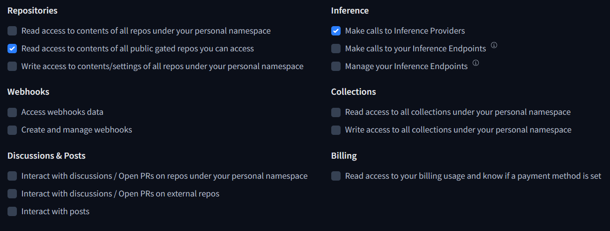

# Data-Battle-RAGDoll
Data battle 2025

## Huggingface inference
The minimal requirement is to have a free huggingface account (which offers free monthly credits) with an access token with the following permissions enabled



## Installation using docker image from Docker Hub

Make sure docker is installed :
```Bash
docker --version
```

If not, please refer to this link :   
https://docs.docker.com/get-started/get-docker/

### Using docker and getting the image from Docker Hub

This docker image contains the result of the preprocess of the documents for the model and as such can work as a standalone

```Bash
docker pull shinlil/data-battle-ragdoll-app:latest
```

### Run docker container

```Bash
docker run -p 8501:8501 -e API_KEY=<huggingface_access_token> shinlil/data-battle-ragdoll-app:latest
```

## Installation without docker

Move to the directory containing Data-Battle-RAGDoll :
```Bash
cd path/to/Data-Battle-RAGDoll
```

### Tesseract OCR 
```bash
sudo apt-get update
sudo apt-get install tesseract-ocr
```

### Ghostscript 
```bash
sudo apt-get update
sudo apt-get install ghostscript
```

### Python requirements

Python 3.12.9

Create a python virtual environment using for example virtualenv

To check if virtualenv is already installed :

```Bash
pip list | grep virtualenv
```

If virtualenv does not appear, run :

```Bash
pip install virtualenv
```

To create a virtual environment, execute the following command :

```Bash
python<version> -m venv .venv
```

Activate the virtual environment :

```Bash
source .venv/bin/activate
```
Download all required librairies :

```Bash
pip install -r requirements.txt
```

### Preprocess

Add all documents that serve as source for the model in a folder named data located at the root of the repository  
A document can be either a pdf or a html

Then run the following : 
```Bash
python dataprocessing.py
```

Some pdf files might not work due to their internal structure erroring PyPDF  
In that case running the repair_pdf.py script and using its output can work as a fix for most pdf files.

## Add token and start the app

Create a .env file at the root of the repository and add the following line while replacing <huggingface_access_token> with your access token

```Bash
API_KEY=<huggingface_access_token>
```

### Run streamlit app

```Bash
streamlit run app.py
```
The app should then become accessible from a browser at http://localhost:8501/

### Using docker

At this stage, you can build a docker image and run using the image
Build the docker image
```Bash
sudo docker build -t <name-docker-image> .
```

Run the docker container
```Bash
docker run -p 8501:8501 -e API_KEY=<huggingface_access_token> <name-docker-image>
```